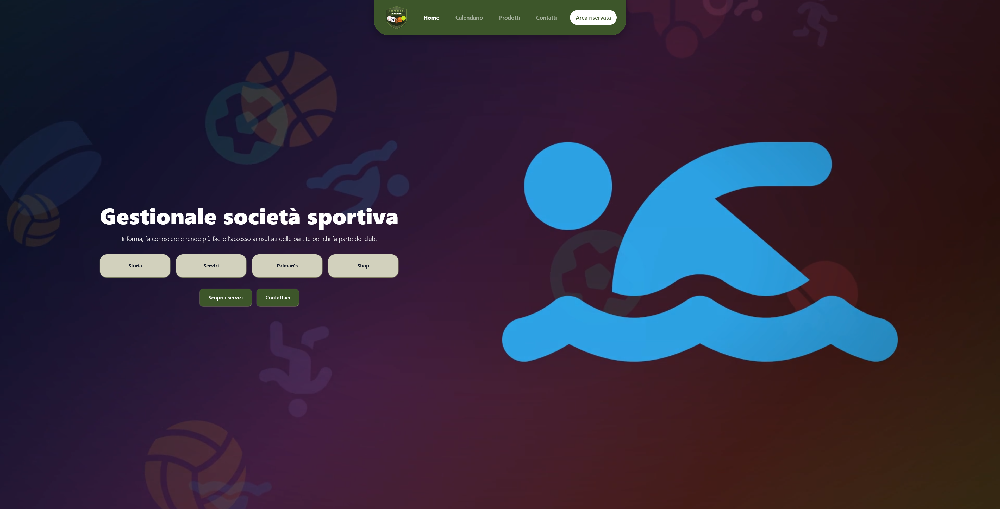

# 🏒 Gestionale Società Sportiva

Applicazione web full‑stack per la gestione di una società sportiva.
Unisce un **sito pubblico** vetrina della società a un'**area riservata** (dashboard) con ruoli differenziati per amministratori e soci, il tutto appoggiato a un database MySQL interrogato tramite PDO.

## 📸 Screenshot

### Home pubblica


<!-- ### Dashboard
<!--  -->

--- -->
---

## 📑 Indice

- [Obiettivo del progetto](#-obiettivo-del-progetto)
- [Tecnologie utilizzate](#-tecnologie-utilizzate)
- [Funzionalità](#-funzionalità)
- [Screenshot](#-screenshot)
- [Gestione del database](#-gestione-del-database)
- [Accessi, sicurezza e query](#-accessi-sicurezza-e-query)
- [Dati dinamici](#-dati-dinamici)
- [Struttura del progetto](#-struttura-del-progetto)
- [Installazione e avvio](#-installazione-e-avvio)
- [Note](#-note)

---

## 🎯 Obiettivo del progetto

Il progetto nasce come gestionale completo per una società sportiva e ha tre obiettivi principali:

1. **Creazione e gestione di un database relazionale** — progettazione delle tabelle, relazioni con chiavi esterne, vincoli e tipi `ENUM`, il tutto definito in un unico schema SQL riproducibile.
2. **Accesso ai dati e query** — ogni interazione con il database avviene tramite **PDO con prepared statement**, organizzata in classi che incapsulano le operazioni CRUD e le query di aggregazione (pattern Singleton per la connessione).
3. **Dati dinamici** — le pagine non mostrano contenuti statici: tabelle, grafici e calendari sono popolati in tempo reale a partire dai dati nel database (grafici statistici, calendario interattivo, news, ordini, impegni).

A questo si aggiunge un sistema di **autenticazione con ruoli** (socio / amministratore) e una logica di **quota associativa** che regola l'accesso all'area riservata.

---

## 🛠 Tecnologie utilizzate

### Backend
- **PHP** — pagine procedurali + classi OOP per la logica di dominio
- **MySQL / MariaDB** — database relazionale
- **PDO** — accesso al database con prepared statement (protezione da SQL injection)
- **XAMPP** — ambiente locale (Apache + MySQL), gestione DB via **phpMyAdmin**

### Frontend
- **HTML5 / CSS3** — markup e foglio di stile personalizzato (`assets/css/style.css`)
- **Bootstrap 5** — layout responsive, navbar/offcanvas, modali, form (installato via npm in `node_modules`)
- **JavaScript (vanilla)** — interazioni lato client (tab, accordion, filtri)
- **Chart.js** — grafici statistici nella dashboard (linee, barre, ciambelle)
- **FullCalendar 6** — calendario interattivo degli impegni
- **Font Awesome 7** + **Animate.css** — icone e animazioni (via CDN)

### Strumenti
- **npm** — gestione delle dipendenze frontend (Bootstrap)
- **Git** — versionamento
- **API esterna DummyJSON** — popolamento iniziale dei prodotti (`scripts/importProdotti.php`)

---

## ✨ Funzionalità

### Sito pubblico
- **Home** con sezioni storia, servizi, palmarès e shop
- **Calendario** con news, risultati e classifiche per categoria
- **Prodotti** con carrello in sessione e ordine ritirabile in sede
- **Contatti** con form di richiesta informazioni salvato a database
- **Registrazione** tramite codice societario monouso e **Login**

### Area riservata — Socio (client)
- Dashboard personale con scadenza quota, ordini e prossimo impegno
- Calendario partite filtrabile per categoria (campionato / coppa)
- Storico ordini effettuati
- Bacheca news e comunicazioni societarie
- Calendario impegni con possibilità di **creare appuntamenti personali**

### Area riservata — Amministratore (admin)
- Dashboard con **grafici statistici** (incassi, iscritti, classifica, prodotti più venduti, partite per categoria)
- Gestione utenti (CRUD, cambio ruolo, richieste informazioni)
- Gestione prodotti e visualizzazione ordini ricevuti
- Gestione news e comunicazioni
- Gestione impegni sportivi

---

## 🗄 Gestione del database

Lo schema completo è in [`DB/sql/schema.sql`](DB/sql/schema.sql) e crea il database `dbSocietaSportiva_app` con le seguenti tabelle:

| Tabella | Descrizione |
|---------|-------------|
| `users` | Soci e amministratori (ruolo `ENUM`, scadenza quota, password hashata) |
| `products` | Prodotti dello shop |
| `purchases` | Ordini, con stato `ENUM('In attesa','pagato','Rimborsato')` e relazioni a `users`/`products` |
| `calendar` | Partite (categoria, tipo `campionato`/`coppa`, risultati) |
| `news` | News e comunicazioni (`ENUM('notizia','comunicazione')`) |
| `registration_codes` | Codici monouso per la registrazione |
| `info_requests` | Richieste informazioni dal form contatti |
| `impegni` | Impegni societari (allenamenti, partite, riunioni…) |
| `appuntamenti_personali` | Appuntamenti privati creati dal singolo socio |

Caratteristiche dello schema:
- **Chiavi esterne** con `ON DELETE CASCADE` / `SET NULL` per l'integrità referenziale
- **Tipi `ENUM`** per vincolare i valori ammessi (ruoli, stati, tipi)
- **`TIMESTAMP` automatici** (`created_at`) e valori di default
- Motore **InnoDB** (supporto a transazioni e vincoli)

---

## 🔐 Accessi, sicurezza e query

### Connessione (pattern Singleton)
La classe [`Db`](DB/classes/Db.php) espone un'unica connessione PDO condivisa, configurata con:
- `ERRMODE_EXCEPTION` — gli errori lanciano eccezioni
- `FETCH_ASSOC` — risultati come array associativi
- `EMULATE_PREPARES = false` — prepared statement reali lato server

Le credenziali sono isolate in `DB/config/config.php` (escluso dal versionamento).

### Classi e query (CRUD)
Ogni entità ha la sua classe in `DB/classes/`, che incapsula le query con **prepared statement**:

- `User` ([`riferimentoUtenti.php`](DB/classes/riferimentoUtenti.php)), `Products`, `Purchases`, `Calendar`, `News`, `InfoRequest`, `Impegni`, `AppuntamentiPersonali`

Esempio di pattern usato ovunque (niente concatenazione di stringhe → no SQL injection):

```php
$stmt = $pdo->prepare('SELECT * FROM users WHERE email = :email');
$stmt->execute([':email' => $email]);
```

### Autenticazione e ruoli
Gestita in [`DB/helpers/auth.php`](DB/helpers/auth.php):
- **Password** salvate con `password_hash()` e verificate con `password_verify()`
- **Sessioni** con `session_regenerate_id()` al login (anti session‑fixation)
- Funzioni guardia: `requireLogin()`, `requireAdmin()`, `requireQuotaValida()`
- **Registrazione a codice**: ci si può iscrivere solo con un codice monouso valido (`registration_codes`)
- **Quota associativa**: il campo `quota_scadenza` regola l'accesso dei soci; scaduta la quota, l'accesso all'area riservata è sospeso (gli admin sono esenti)

---

## 📊 Dati dinamici

Il progetto mostra dati generati a runtime, non statici:

- **Grafici dashboard (Chart.js)** alimentati da query di aggregazione SQL, ad esempio:
  - `incassoPerMese()`, `contaPerStato()`, `topProdotti()` (in `Purchases`)
  - `iscrittiPerMese()`, `contaQuote()` (in `User`)
  - `bilancioRisultati()`, `partitePerCategoria()` (in `Calendar`)
  - uso di `GROUP BY`, `SUM`, `COUNT`, `CASE WHEN`, `UNION ALL`
- **Calendario interattivo (FullCalendar)** che carica impegni e appuntamenti dal database
- **Filtri dinamici** su news e partite tramite parametri GET
- **Carrello** gestito in sessione PHP

### Script di popolamento (seeder)
Nella cartella `scripts/` (accessibili **solo come admin**):
- `importProdotti.php` — importa prodotti reali dall'API **DummyJSON**
- `generaPartite.php` — genera partite casuali nel calendario
- `notizieSportive.php` — genera news e comunicazioni di esempio

---

## 📁 Struttura del progetto

```
Gestionale-Hockey/
├── index.php                  # Home pubblica (entry point)
├── calendario.php  prodotti.php  contatti.php
├── login.php  register.php  logout.php  quotaScaduta.php
├── dashboard.php              # Dashboard (smista admin / client)
│
├── assets/                    # File statici
│   ├── css/  → style.css
│   ├── js/   → cmd.js
│   ├── img/  → immagini e logo
│   └── video/→ hero-sport.mp4
│
├── includes/                  # Partial condivisi (header, footer)
├── scripts/                   # Seeder / import (solo admin)
├── docs/                      # Documentazione e tracce
│
├── DB/
│   ├── classes/               # Classi OOP (una per entità + Db)
│   ├── config/                # config.php (credenziali, NON versionato)
│   ├── data/                  # datiFittizi.php (dati di esempio)
│   ├── helpers/               # auth.php
│   └── sql/                   # schema.sql
│
├── admin/                     # Pagine area amministratore (+ modali/)
└── client/                    # Pagine area socio
```

---

## 🚀 Installazione e avvio

> Ambiente di riferimento: **XAMPP** su Windows, progetto in `C:\xampp\htdocs\Gestionale-Hockey`.

1. **Clona il repository** dentro la cartella `htdocs` di XAMPP.

2. **Avvia Apache e MySQL** dal pannello di controllo XAMPP.

3. **Crea il file di configurazione** `DB/config/config.php` (è escluso da Git per sicurezza):
   ```php
   <?php
   define('DB_HOST', 'localhost');
   define('DB_NAME', 'dbSocietaSportiva_app');
   define('DB_USER', 'root');
   define('DB_PASS', '');
   define('DB_CHARSET', 'utf8mb4');
   ```

4. **Crea il database**: apri phpMyAdmin, scheda **SQL**, e incolla il contenuto di [`DB/sql/schema.sql`](DB/sql/schema.sql).

5. **Installa le dipendenze frontend**:
   ```bash
   npm install
   ```

6. **Crea il primo amministratore** (necessario perché gli script di popolamento richiedono un admin loggato). In phpMyAdmin inserisci un utente admin — la password va inserita già hashata (puoi generarla con `password_hash('latuapassword', PASSWORD_DEFAULT)` in un piccolo script PHP):
   ```sql
   INSERT INTO users (name, email, password, role, quota_scadenza)
   VALUES ('Admin', 'admin@club.it', '<hash_generato>', 'admin', '2030-01-01');
   ```

7. **(Opzionale) Popola i dati di esempio** — dopo aver effettuato il login come admin, visita:
   - `scripts/importProdotti.php`
   - `scripts/generaPartite.php`
   - `scripts/notizieSportive.php`

8. **Apri il sito**: <http://localhost/Gestionale-Hockey/>

---

## 📝 Note

- Le credenziali del database (`DB/config/config.php`) **non sono versionate**: ricreale come mostrato sopra.
- Gli script in `scripts/` sono **distruttivi** (svuotano e rigenerano le tabelle) e protetti da `requireAdmin()`: usali solo in fase di sviluppo.
- Il pagamento dei prodotti avviene fisicamente in sede; l'ordine online nasce quindi nello stato *In attesa*.
- Progetto a scopo didattico.
